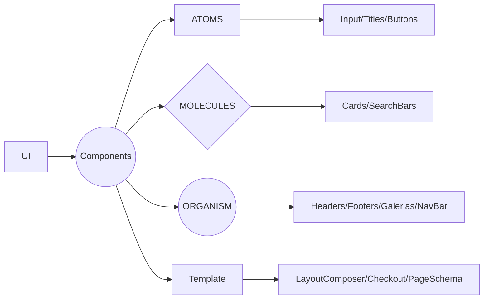

# ATOMIC DESIGN

Atomic Design é uma metodologia de design de interfaces de usuário que aborda a criação de componentes de interface de usuário como se fossem átomos. É uma abordagem sistemática para a construção de interfaces, na qual componentes menores são combinados para criar componentes maiores e mais complexos, até chegar à construção completa de uma interface. O objetivo é criar componentes reutilizáveis e padronizados que podem ser facilmente combinados para construir diferentes tipos de interfaces. Atomic Design se concentra em tornar o design da interface de usuário escalável e fácil de manter, ajudando a equipe de desenvolvimento a ser mais eficiente e a construir interfaces de usuário consistentes e de alta qualidade.

Flow Chart de exemplo Atomic Design:

Aqui está um exemplo de estrutura de pastas com base no conceito de Atomic Design:

- Components
  - atoms
    - button
    - icon
    - input
  - molecules
    - form
    - header
    - search-bar
  - organisms
    - cart
    - footer
    - header
  - templates
    - checkout
    - home
    - product
- pages
  - index.js

Na pasta `components`, há várias pastas para cada nível do Atomic Design: `atoms`, `molecules`, `organisms` e `templates`. Cada pasta contém componentes correspondentes ao seu nível, como `button`, `form`, `cart` e `home`.

A pasta `pages` contém arquivos de página que importam e combinam componentes de diferentes níveis do Atomic Design para compor a interface de usuário. O arquivo `index.js` é um exemplo de uma página que pode ser criada a partir dos componentes armazenados nas outras pastas.

Esta estrutura de pastas ajuda a manter a organização e a facilidade de manutenção do código ao longo do tempo. Além disso, permite que os componentes sejam reutilizados em várias páginas e sejam fáceis de manter e atualizar.
